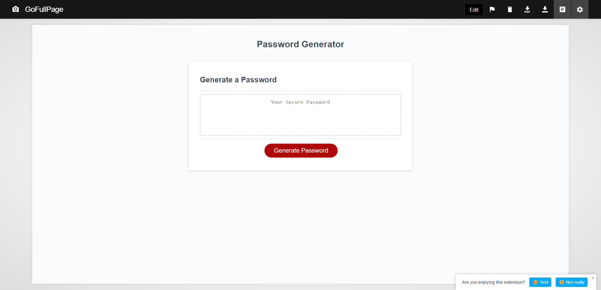

# password-generator
UT's Fullstack Flex Web Development Bootcamp - Challenge 03

## Description
The password generator assignment is to showcase May Pham's ability to code in Javascript. The given assignment used the practice of window prompts, windows alerts, booleans, functions, for loops, if statements, randomization of variables, and more to complete the site. The requirements of the password generator include that the password be between 8-128 characters, have the option to include special, numeric, lowercase, and uppercase characters, and to have the site successfully generate a password given the input parameters.

## Usage

https://mayphamx.github.io/password-generator/

https://github.com/mayphamx/password-generator